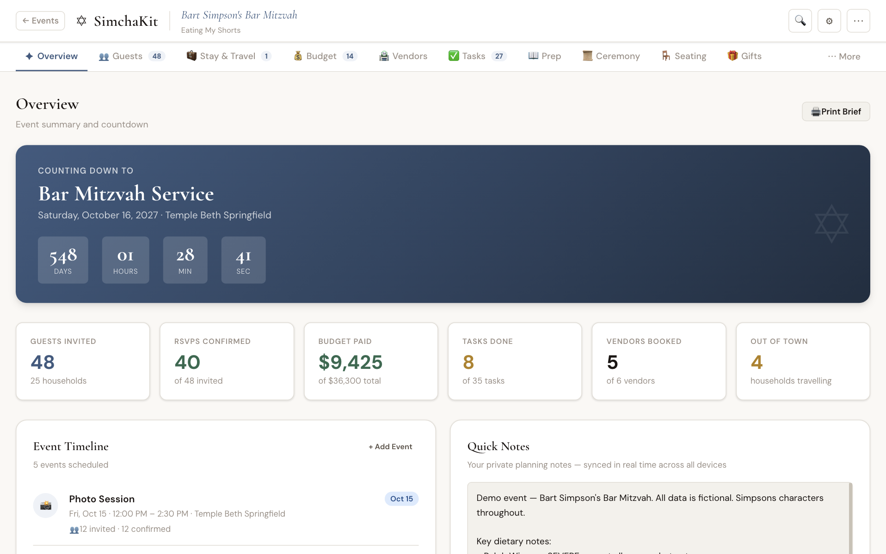
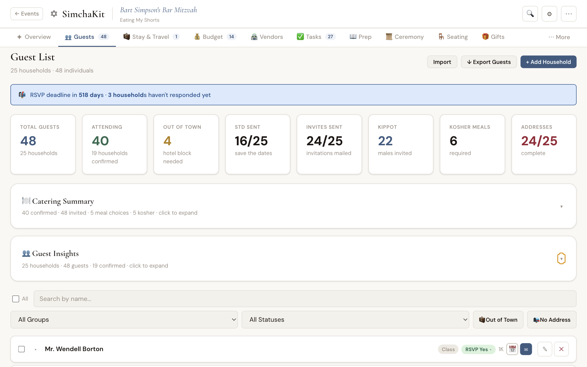
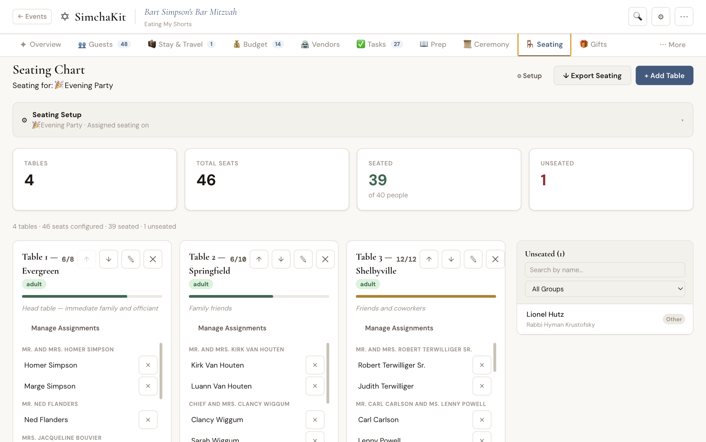
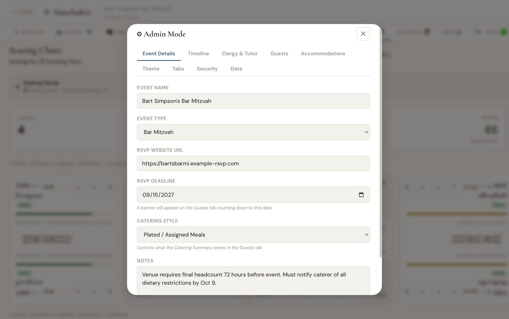

# SimchaKit

A real-time event planning web app for celebrations — B'nei Mitzvot, weddings, and other simchas.


## Screenshots

### Overview Dashboard


### Guest Management


### Seating Chart


### Admin Configuration


## Features

- **Guest Management** — households, people, formal names, dietary requirements, RSVP tracking
- **Sub-Event Support** — track attendance across multiple events (service, kiddush, reception)
- **Budget Tracking** — expenses, payments, vendor costs, gratuity calculator
- **Vendor Management** — contacts, contracts, payment schedules
- **Task Lists** — categorized to-dos with due dates and completion tracking
- **Seating Charts** — table management with drag-and-drop assignment
- **Gift Tracking** — record gifts and track thank-you notes
- **Favor Management** — track sweatshirts, kippot, or other party favors by size
- **Day-Of Mode** — streamlined mobile view for event day with hot sheet and vendor contacts
- **Real-Time Sync** — WebSocket-based updates across all connected devices (V2) / fetch-on-navigate (V3)
- **Theming** — customizable color palettes and event branding
- **Print Brief** — generate a comprehensive event summary document
- **CSV Import/Export** — import guest lists, export for invitation vendors
- **Backup & Restore** — export a full JSON backup and restore from any previous backup via Admin Mode → Data

## Tech Stack

### V3 — SimchaKit Platform (SaaS, hosted at simchakit.vercel.app)

- **Frontend**: Vite + React 18
- **Auth**: Supabase magic link (passwordless email)
- **Database**: Supabase (Postgres + Row Level Security)
- **Hosting**: Vercel (frontend + serverless API functions)
- **Payments**: Stripe (one-time fee per event)
- **Styling**: Custom CSS with CSS variables for theming

### V2 — Self-Hosted NAS Edition (active through October 2026)

- **Frontend**: Vite + React 18
- **Backend**: Node.js + Express + WebSocket
- **Data**: JSON file storage (per-event)
- **Styling**: Custom CSS with CSS variables for theming

## Quick Start

### V3 — SimchaKit Platform

Visit [simchakit.vercel.app](https://simchakit.vercel.app), sign in with your email, and create your first event.

### V2 — Self-Hosted

#### Prerequisites

- Node.js v18, v20, or v22
- npm v8+

#### Installation

```bash
# Clone the repository
git clone https://github.com/rebrook/simchakit.git
cd simchakit

# Install server dependencies
npm install

# Install client dependencies
cd client
npm install

# Build the client
npm run build
cd ..

# Start the server
node server.js
```

The app will be available at `http://localhost:3000/simcha/`

#### Creating Your First Event

1. Navigate to `http://localhost:3000/simcha/` — this opens the Event Picker
2. Click the **+ New Event** button
3. Enter an Event ID (e.g., `smith-wedding-2026`) — lowercase letters, numbers, and hyphens only
4. Click **Create**

You'll be taken to your new event dashboard. From there, open the **Admin** panel to configure:
- Event name and type (Bat Mitzvah, Wedding, etc.)
- Theme and color palette
- Timeline with sub-events (service, reception, etc.)
- Clergy and venue contacts

## Documentation

- **[DEPLOY.md](DEPLOY.md)** — Technical deployment reference
- **[HOW_TO_DEPLOY.md](HOW_TO_DEPLOY.md)** — Plain-English step-by-step guide

## Project Structure

```
simchakit/
├── client/                  # Vite + React frontend (shared build tooling)
│   ├── public/              # Static assets (favicon, changelog.json)
│   ├── index.html           # V2 Vite HTML entry
│   ├── index.v3.html        # V3 Vite HTML entry
│   ├── vite.config.js       # V2 build config (base: /simcha/, src/ alias)
│   ├── vite.config.v3.js    # V3 build config (base: /, src-v3/ alias)
│   ├── api/                 # Vercel serverless functions (V3 only)
│   │   ├── validate-coupon.js
│   │   ├── create-checkout-session.js
│   │   └── stripe-webhook.js
│   ├── src/                 # V2 source — never modified for V3 work
│   │   ├── components/      # Tab and modal components
│   │   ├── constants/       # Shared constants
│   │   ├── hooks/           # Custom React hooks
│   │   └── utils/           # Utility functions
│   └── src-v3/              # V3 source — never modified for V2 work
│       ├── App.v3.jsx       # V3 auth-aware root
│       ├── App.css          # Shared stylesheet
│       ├── main.v3.jsx      # V3 React entry point
│       ├── components/      # V3 components (shell, tabs, events, auth)
│       ├── constants/       # V3 constants
│       ├── hooks/           # V3 hooks (useEventData, useDarkMode)
│       ├── lib/             # Supabase client
│       └── utils/           # V3 utilities
├── src/                     # V2 Express server modules
│   ├── router.js            # API routes
│   ├── state.js             # State management
│   └── ws.js                # WebSocket handler
├── public/                  # V2 served files: Event Picker + per-event folders
│   ├── index.html           # V2 Event Picker
│   ├── favicon.svg          # Favicon
│   ├── assets/              # Built JS/CSS bundles (shared)
│   └── {event-id}/          # Per-event folders
│       └── index.html       # V2 event dashboard entry point
├── server.js                # V2 Express entry point
├── deploy.sh                # V2 build and deploy script
├── vercel.json              # V3 Vercel build + API routing config
└── changelog.json           # Version history (V2.x and V3.x)
```

## Deployment

### V3 — Vercel

Push to the `main` branch. Vercel automatically builds and deploys from `client/` using `vite.config.v3.js`. Serverless functions in `client/api/` are deployed alongside the frontend.

### V2 — Self-Hosted NAS

SimchaKit V2 is designed to run on any server with Node.js — a VPS, home server, NAS, or local machine.

```bash
# Deploy updates (after copying changed source files)
bash deploy.sh
```

See [HOW_TO_DEPLOY.md](HOW_TO_DEPLOY.md) for detailed instructions.

## Development

### V3

```bash
cd client
npm run dev  # Vite dev server at http://localhost:5173/
```

### V2

```bash
# Start the Express server (terminal 1)
node server.js

# Start Vite dev server with hot reload (terminal 2)
cd client
npm run dev
```

The V2 dev server runs at `http://localhost:5173/simcha/` with API calls proxied to the Express server.

## License

MIT License — see [LICENSE](LICENSE) for details.

## Author

Brook Creative LLC
